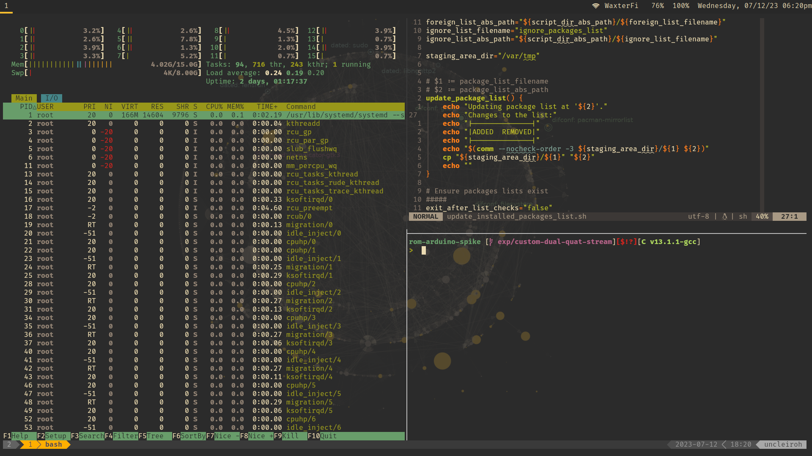

# My Dotfiles

A place to track my configuration files (dotfiles). They are personal and some
of them are pretty segsy.

Taken on 07-12-2023.

Packages installed on the system (Arch Linux) are tracked in committed files:

- standard packages:
  `./.dotfiles-not-a-soy-dev/installed_packages/pacman_packages_list`
- AUR packages:
  `./.dotfiles-not-a-soy-dev/installed_packages/foreign_packages_list`
- packages to omit from these lists:
  `./.dotfiles-not-a-soy-dev/installed_packages/ignore_packages_list`

## Installation

To apply all dot files:

1. Install `yadm`
1. Run `yadm clone <link-to-this-repo>`
1. Run `yadm bootstrap`

## Display scripts

I've found its easiest to setup displays using a GUI, for example, `arandr`,
rather than direct `xrandr` commands. After the display configuration is
correct, it can be exported as a script and saved to `.screenlayout/`.
`.screenlayou/auto_display.sh` finds which outputs are connected and calls the
corresponding display script that was generated by the GUI. This script allows
other programs, for example `i3wm`, to update the display configuration in a
standard way. The script will take care of doing what is 'right'. The specific
mappings and generated scripts will need to be modified on a **per-machine
basis**.

## Pacwall

`pacwall` generates a kick-ass wallpaper that is an annotated dependency graph
of the currently installed system packages. It sets the wallpaper using a hook
provided in its configuration. Entities wanting to update the wallpaper should
call pacwall to ensure a single-source-of-truth for the wallpaper setting
process.

## On-startup programs

The window manager, `i3wm`, runs the "startup" programs because many display
managers don't run the traditional x files. For example, `lightdm` doesn't run
`.xinitrc`.
